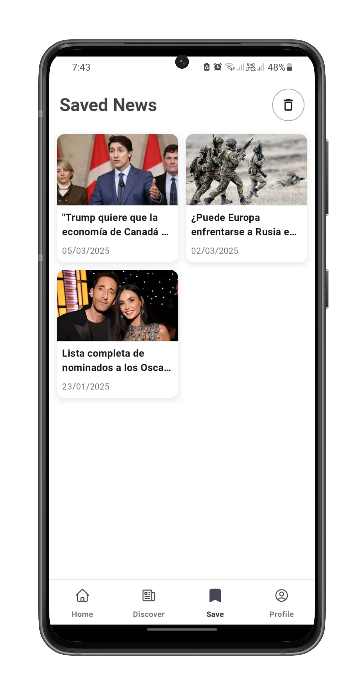
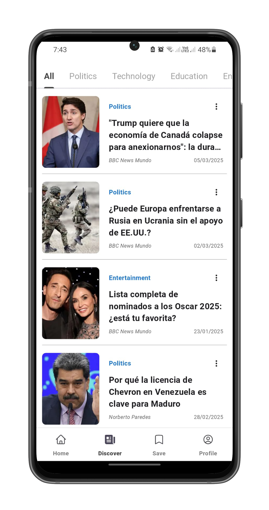
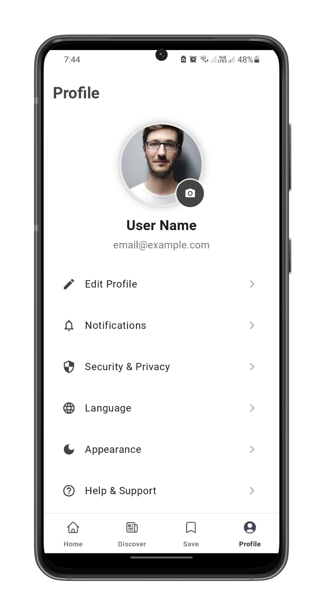
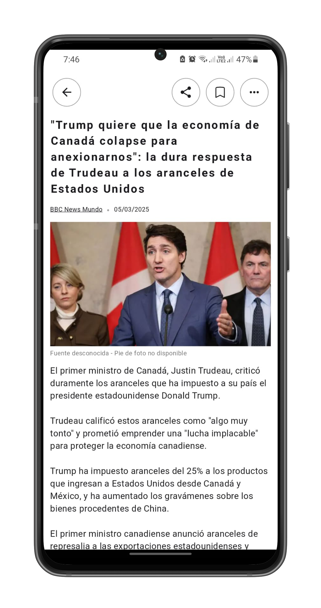

# Flutter UI/UX Practice — News App

Este proyecto forma parte de una serie de prácticas de diseño UI/UX utilizando Flutter.  
El objetivo es replicar interfaces reales para fortalecer habilidades de desarrollo y diseño de aplicaciones móviles.

> ⚠️ **Nota**: Este proyecto es un prototipo/mockup realizado con fines educativos y demostrativos.

## 🎨 Inspiración de Diseño
[News Mobile App - Dribbble](https://dribbble.com/shots/25403026-News-Mobile-App)

## 📱 Capturas de Pantalla

  
  
  
  
  

## 🛠️ Tecnologías Utilizadas
- Flutter
- Dart

## 👨‍💻 Desarrollador

- **Esteban Ramirez**
  - GitHub: [@stebann](https://github.com/stebann)
  - LinkedIn: [estebanrramirezm](https://linkedin.com/in/estebanrramirezm)
